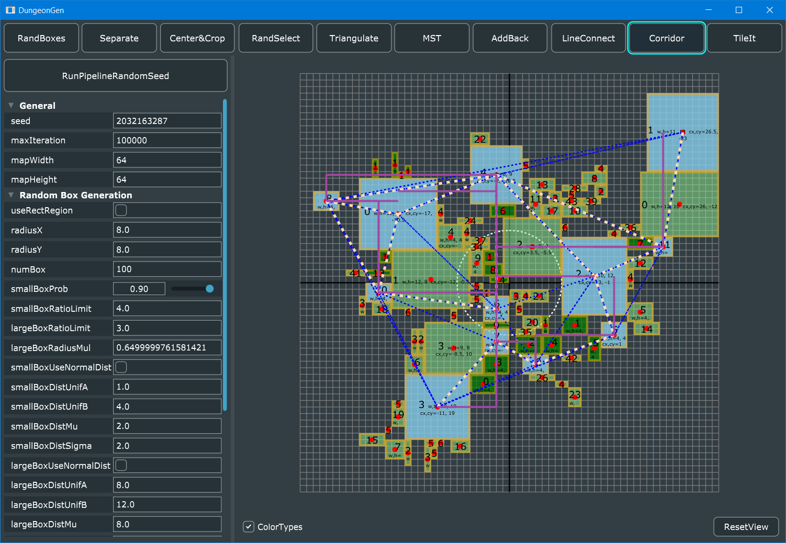

# Simple Dungeon Generator

This repository implements the algorithm in [this post](https://www.gamedeveloper.com/programming/procedural-dungeon-generation-algorithm), serves as the independent algorithm test before merging into a Unreal game project. So the code is messy.

This code uses [JUCE](https://github.com/juce-framework/JUCE) and [delaunator-cpp](https://github.com/delfrrr/delaunator-cpp).

# Setup

Download JUCE and use Projucer to generate solution files for different platforms.

# Screenshots

